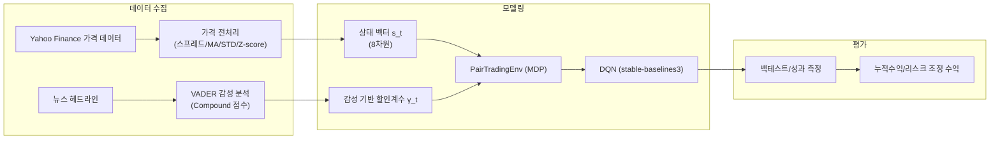

# 페어 트레이딩 강화학습 MDP 환경
MDP와 뉴스 감성 통합 기능을 이용하여 트레이딩 전략을 구형하여 제 3자가 모든 결과를 재현할 수 있도록 합니다.

## 소프트웨어 및 하드웨어 요구사항

-소프트웨어-
 - Python 3.8 이상  
  - gymnasium ≥ 0.28  
  - numpy, pandas  
  - yfinance
  - nltk (VADER 감성 분석)  
  - beautifulsoup4 (웹 스크래핑)  
  - stable-baselines3 (DQN 구현)  
  - matplotlib, seaborn (평가 시각화)

## 데이터 소스
- 가격 데이터: Yahoo Financ
- 뉴스 헤드라인 yfinance.Ticker("Company").news
- 감성 모델: NLTK VADER (https://www.nltk.org/_modules/nltk/sentiment/vader.html)

## 시스템 아키텍처(구조도)


## 목표
왜 페어 트레이딩인가?
 두 상관 자산 간 스프레드의 평균회귀를 이용한 시장 중립 전략 (https://arxiv.org/pdf/2407.16103)
 
왜 강화학습 + 뉴스 감성인가?
 전통적 임계치 규칙은 실간 뉴스 변동을 반영하지 않음. 뉴스 감성을 할인 인자나 보상에 반영하여 시장 환경 변화에 적응하도록 함.

목표:
 1.  MDP 환경 구현
 2.  뉴스 감성 기반 동적 할인 인자 통합
 3.  데이터들을 이용해 학습시켜 리스크 조정 수익 최대화
  
## 주요 성과
1. 환경 구현: `PairTradingEnv`  
   - **상태**: 8차원 벡터 (spread, MA, STD, Z-score, price, diff_score, MCD_closed_price, YUM_closed_price)  
   - **행동**: {0: 보유, 1: 롱, 2: 숏}  
   - **보상**: 거래 비용 차감 후 P&L, 감성 조정 γ 적용
  
2. 감성 통합:
   y_t = t_0 + a(=0.15)
   
4. 백 테스트: 2020/01/02~ 2024/01/02
   - 누적수익: $199.9

## 📝 문제 정의 (Problem Definition)

본 프로젝트의 목표는 매 시점 두 주식의 스프레드(Spread)에 대해 매수(Long), 매도(Short), 관망(Hold) 행동을 수행하는 **MDP 기반 자동화 시스템**을 구축하는 것입니다. 실시간 뉴스 감성 분석(Live News Sentiment)을 반영하여 동적으로 보상을 조절함으로써, 리스크를 관리하고 수익을 극대화합니다.

---

## 🔍 MDP 모델링: 상태, 행동, 전이 및 관측

강화학습 모델이 의사결정을 내리기 위한 핵심 요소인 $S, A, T, O$를 다음과 같이 정의합니다.

- **상태 (State, $s_t$)**: $s_t \in \mathbb{R}^8$
  - 스프레드, 이동평균, 표준편차, Z-score, 현재가, 감성 점수 차이, 종목별 종가 등 8차원 벡터로 구성됩니다.
- **행동 (Action, $a_t$)**: $\{0, 1, 2\}$
  - `0: Hold(관망)`, `1: Long(매수)`, `2: Short(매도)`
- **전이 (Transition)**: 
  - 새로운 시장 가격 유입 및 시장의 확률적 변동(Stochasticity)에 의해 다음 상태($s_{t+1}$)가 결정됩니다.
- **관측 (Observation)**:
  - 매 스텝마다 모델에 상태 벡터가 직접 제공됩니다 ($O(s_t) = s_t$).

---

## 💡 해결 방법론 (Solution Method)

데이터 기반의 최적 정책을 찾기 위해 다음 수식을 사용합니다.

- **정책 (Policy)**: $a_t = \arg\max_a Q(s_t, a)$ (Q-값이 최대인 행동 선택)
- **보상 (Reward)**: $R_t = (PnL_t - c) \times \gamma_t$
  - 여기서 $\gamma_t = \gamma_0 + \alpha \times \text{sent}_t$ (뉴스 감성에 따른 동적 가중치)
- **손실 함수 (Loss)**: 예측 Q-값과 타겟 Q-값 사이의 **MSE(Mean Squared Error)** 최소화

---

## 🛠 구현 상세 (Implementation Details)

### 1. 환경 구성 (`PairTradingEnv`)
- **Gymnasium** 라이브러리를 활용하여 표준 RL 환경을 구현했습니다.
- `action_space`: `Discrete(3)`
- 주요 메서드: `reset()`, `step(a)`, `render()` 구현 완료

### 2. 데이터 전처리 (Data Preprocessing)
Python의 Pandas와 Numpy를 활용하여 금융 지표를 생성합니다.
```python
# 스프레드 지표 계산 예시
spread_MA = spread.rolling(window=win).mean()
spread_STD = spread.rolling(window=win).std(ddof=0)
Z_score = (spread - spread_MA) / spread_STD

# 뉴스 감성 차이 및 종목 데이터 결합
diff_score = np.zeros_like(spread)
MCD_price = raw["MCD"]
YUM_price = raw["YUM"]
```

## Resources:
1. https://www.insightbig.com/post/developing-a-profitable-pairs-trading-strategy-with-python
2. https://databento.com/blog/build-a-pairs-trading-strategy-in-python
3. https://medium.databento.com/build-a-pairs-trading-strategy-in-python-a-step-by-step-guide-dcee006e1a50?gi=5738dae53da6
4. https://medium.com/@ngao7/markov-decision-process-value-iteration-2d161d50a6ff
5. https://wire.insiderfinance.io/markov-decision-processes-mdp-ai-meets-finance-algorithms-series-7f34de5680d5
6. https://python.plainenglish.io/understanding-markov-decision-processes-17e852cd9981
7. https://www.datacamp.com/tutorial/markov-chains-python-tutorial
8. https://blog.naver.com/chunjein/100203065865
9. https://www.youtube.com/watch?v=YDMSqal-RZ4
10. https://domino.ai/blog/deep-reinforcement-learning
11. https://www.nltk.org/howto/sentiment.html
12. https://alexanderozkan.com/Sentiment-Analysis-as-a-Trading-Indicator/
13. https://newsdata.io/blog/access-yahoo-finance-news-api/
14. https://developer.yahoo.com/api/
15. https://ranaroussi.github.io/yfinance/
